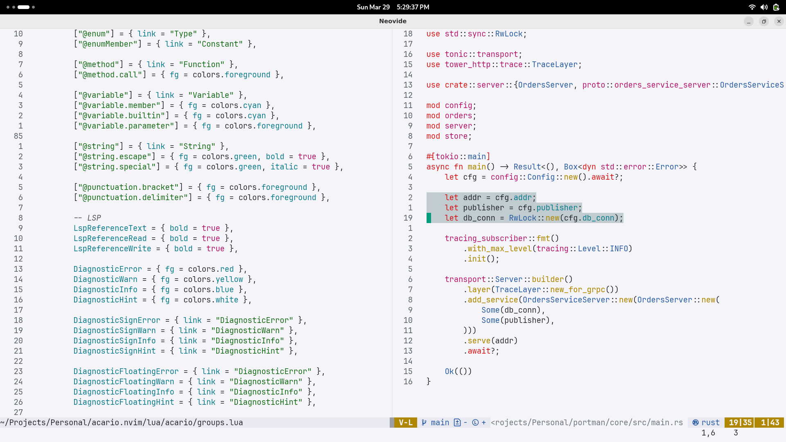
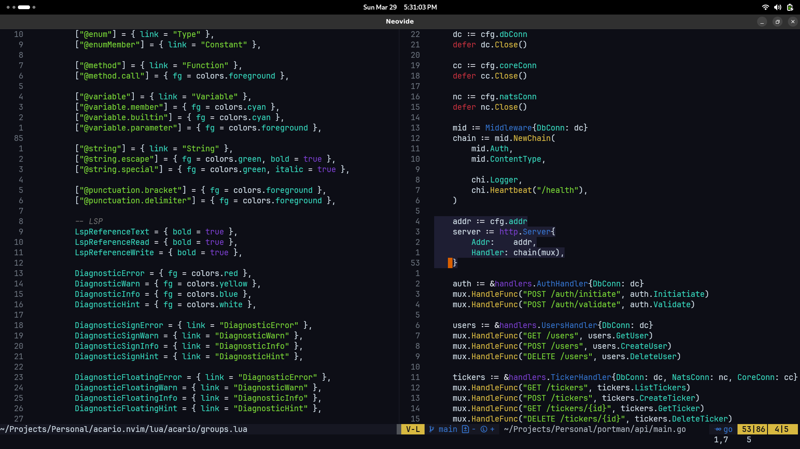

# acario.nvim

Port of the Emacs Doom Acario Theme.

> [!IMPORTANT]
> This colorscheme is still in beta and your favorite plugin might not look good on it yet as I've only tested it on plugins I use. Issues and PRs are welcome!

## Screenshots

<p align="center">
  
  <br>
  <b>acario_light</b>
</p>

<br>

<p align="center">
  
  <br>
  <b>acario_dark</b>
</p>

## Installation

If you enjoy living on the edge, you can install it via your favorite plugin manager. Here's an example using [Lazy.nvim](https://github.com/folke/lazy.nvim):

```lua
return {
    "0x-ximon/acario.nvim",
    name = "acario",
    lazy = false,
    priority = 1000,
}
```

> [!WARNING]
> This colorscheme requires Neovim 0.8 or higher.

## Credits

This colorscheme is a port of the Emacs Doom Acario Theme and is a fork of the [Dracula.nvim](https://github.com/Mofiqul/dracula.nvim) colorscheme.
